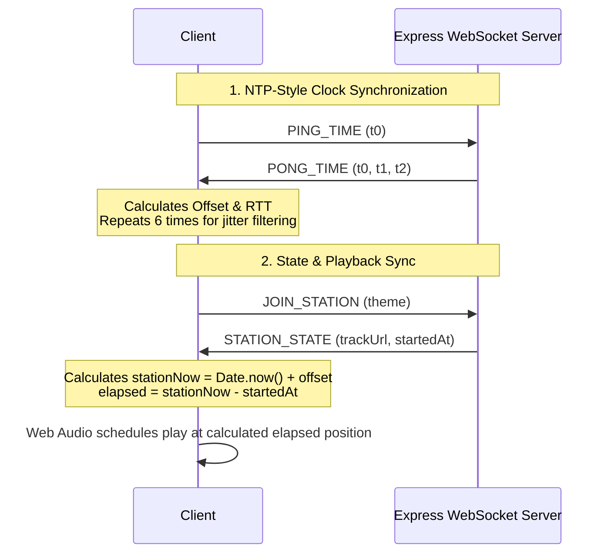

# One Station, Any Vibe 🎧

**One Station, Any Vibe** is a synchronized multi-device music player ("jukebox stations") designed to solve the problem of playing music in perfect synchronization across multiple devices. Users can create or join a station under any arbitrary theme name. The app implements a real NTP-style time-sync protocol to estimate clock offsets between each client and the server, schedules playback against this shared time reference using the Web Audio API, and automatically handles late-joiners and connection dropouts by calculating precise mid-track offsets without restarting tracks from zero.

## Prerequisites

- **Node.js**: v20 or later
- **npm**: v10 or later
- **Modern Web Browser**: Chrome, Edge, Safari, or Firefox with Web Audio API and Service Worker support.

## Installation

To install all backend and frontend dependencies, run:

```bash
npm install
```

## Running the Application

To boot both the Express WebSocket API and the Vite frontend server concurrently:

```bash
npm run dev
```

By default, the Vite development server will start at:
👉 **[http://localhost:5173](http://localhost:5173)**

The Vite dev server will proxy static requests and WebSocket traffic directly to the Express server running on port `3000`.

To run in production mode (production bundle serving directly from Express):
```bash
# Build frontend client and compile TypeScript server
npm run build

# Start the Express server
node dist/server/server.js
```
The application will then be accessible at **[http://localhost:3000](http://localhost:3000)**.

## Running Tests

To run the unit tests for clock offset calculations and mid-track join calculations:

```bash
npm run test
```

---

## How to Demo

### 1. Multi-Device Synchronization (Local & LAN)

1. Open **[http://localhost:5173](http://localhost:5173)** in a browser window.
2. Enter a station name (e.g. `vibe-zone`) and click **Join Station**.
3. Open a second browser tab, or an **Incognito Window**, or navigate to the page on a mobile device on the same local network using your host machine's LAN IP (e.g., `http://192.168.1.XX:5173`).
4. Join the exact same station name `vibe-zone` on the second device.
5. In client A, pick a track (like *Retro Synth Wave*) and click **⚡ Broadcast Play**.
6. Observe that both devices begin playing the sound in perfect sync.

### 2. Offline / Reconnect Resync Recovery

1. While a track is playing in sync, select one client window.
2. In the "Dev Tools & Connection Simulator" card, click **🔌 Disconnect Socket** (or open browser DevTools -> Network -> toggle "Offline").
3. The client's status badge will change to **Disconnected**. 
4. Allow the track to continue playing. Wait 5-10 seconds.
5. Click **🔌 Reconnect Socket** (or toggle DevTools back to "Online").
6. The client will reconnect, perform a full clock synchronization, send a `RESYNC_REQUEST` to retrieve the server's current playback state, and resume playing.
7. Observe that it **does not restart the track from zero**. Instead, it resumes exactly at the correct offset aligned with the other synchronized client.

### 3. Independent Station States

1. Open three browser tabs.
2. Join tab A and tab B to `lofi-chill`.
3. Join tab C to a completely different theme: `retro-synth`.
4. Play a track on `lofi-chill`. Tab A and Tab B play in sync, while Tab C remains idle.
5. Play a different track on `retro-synth`. Tab C plays its track independently at its own position without interfering with the `lofi-chill` station.

---

## Architecture & How It Works



### WebSocket Relay
The backend acts as a lightweight, memory-efficient WebSocket relay. It maps rooms/stations by arbitrary strings typed by the user, tracks the active connection instances (WebSockets) currently inside each room, and logs connection changes. It has no hardcoded room limitations.

### NTP-style Clock Sync
Two devices rarely agree on their local clock `Date.now()`. To schedule playback accurately, we measure the Network Round-trip Time (RTT) and compute the clock offset using:
$$\text{offset} = \frac{(t_1 - t_0) + (t_2 - t_3)}{2}$$
We record 6 samples, filter out high-RTT anomalies (jitter), and average the best offsets. This offset is applied locally to adjust `Date.now()` to the server's reference clock.

### Elapsed-Position Scheduling
Rather than starting tracks instantly upon receiving messages (which introduces network latency drift), the server records the exact server time `startedAt` when a track begins. When clients join or reconnect, they compute their synchronized local time, find `elapsed = nowSynced - startedAt`, and use the Web Audio API to schedule playback starting precisely at `elapsed` seconds.

### Service Worker Caching
A registered Service Worker (`public/sw.js`) intercepts network requests.
- **Audio Assets**: The fetch handler caches media requests in a dedicated audio Cache. Subsequent playback retrieves files directly from local storage, making the system immune to transient Wi-Fi drops.
- **App Shell**: The main shell assets are cached on install, allowing the client interface to load instantly offline.

---

## File Map

- [lib/sync/clock.ts](file:///c:/Users/harsh/Desktop/nostalgic-jukebox/lib/sync/clock.ts): Contains core NTP offset estimation equations, sample calculations, and elapsed track calculations.
- [lib/sync/clock.test.ts](file:///c:/Users/harsh/Desktop/nostalgic-jukebox/lib/sync/clock.test.ts): Unit tests verifying the clock formulas under various network drift scenarios, including mid-track joins.
- [public/sw.js](file:///c:/Users/harsh/Desktop/nostalgic-jukebox/public/sw.js): The committed Service Worker script registering routing handlers to cache audio and shell assets.
